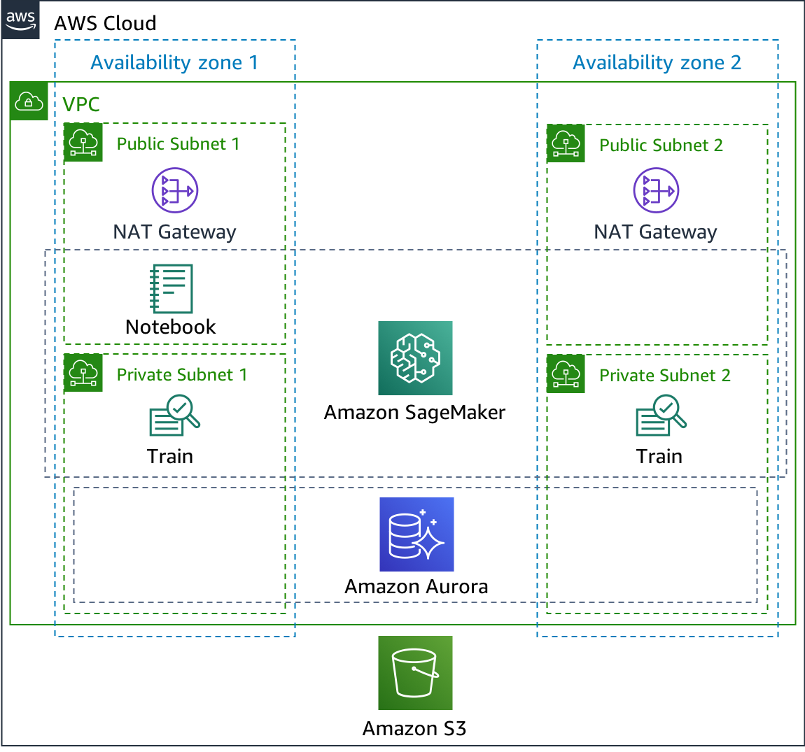

## Amazon SageMaker Optuna HPO Blog

This sample code demonstrates how to build an Amazon SageMaker environment for HPO using [Optuna](https://github.com/pfnet/optuna) (an open source hyperparameter tuning framework).

You can set up the environment depicted below with the [CloudFormation template](https://github.com/aws-samples/aws-sagemaker-optuna-hpo-blog/blob/master/template/optuna-template.yaml).

 

Then clone this repository and try examples in the `examples/` directory. The blog post is basically structured to demonstrate the `examples/chainer_simple/`.

## License Summary

This sample code is made available under a modified MIT license. See the LICENSE file.
